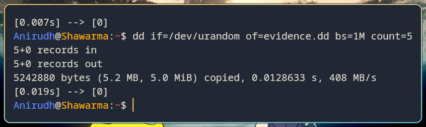
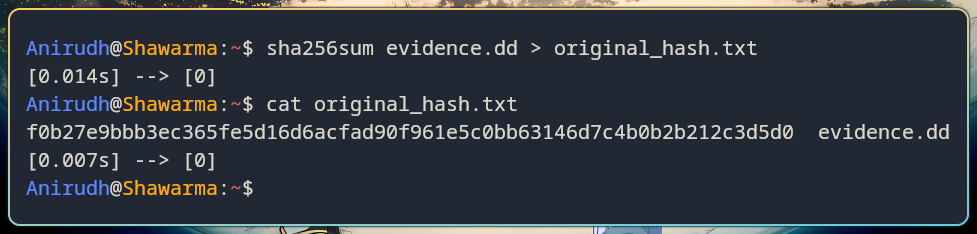
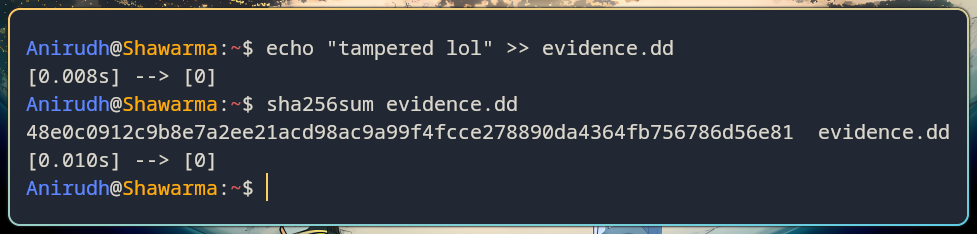

# Disk Imaging
[Link to the resource](https://ctf101.org/forensics/what-is-disk-imaging/)

### Overview
- Forensic image is an exact copy of a physical drive stored virtually
- Very useful incase tampering is necessary, keeping the original drive out of modification
- Write blockers prevent unintended modifications to the original while an image is being created

### Integrity & Checksums
- The file integrity is verified by the usage of cryptographic hashes
- The checksum of the file changes if a single bit is altered
- Tools like `sha256sum` and `md5sum` are used to generate and compare hashes

## Snapshots
- Using `dd` to create an disk image of 5 MB size
```
dd if=/dev/urandom of=evidence.dd bs=1M count=5
```
  
- Generating the checksum of the image before tampering
- **Checksum:** f0b27e9bbb3ec365fe5d16d6acfad90f961e5c0bb63146d7c4b0b2b212c3d5d0

- After Tampering, a different checksum returns
- **Checksum:** 48e0c0912c9b8e7a2ee21acd98ac9a99f4fcce278890da4364fb756786d56e81

- Comparing the checksums proves that the image was tampered with
