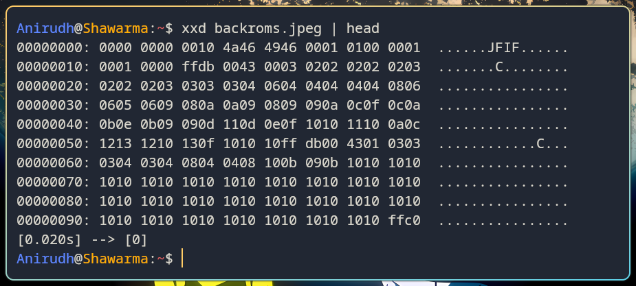
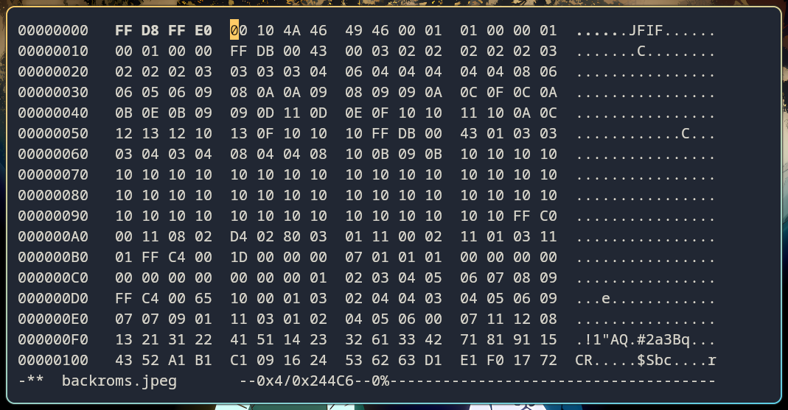

# Hex Editors
[Link to the resource](https://ctf101.org/forensics/what-is-a-hex-editor/)

### Overview
- File extensions are just software suggestions; any file is actually defined entirely by its raw binary structure
- Hex editors allow to view and manipulate the hexadecimal pairs and ASCII text which make up the file's core logic
- `hexedit` is an interactive terminal editor which is perfomative without a GUI

### Forensic Applications
- **File Carving & Recovery:** Locating standard headers within unallocated disk space to recover deleted files
- **Header Reconstruction:** Manually rewriting corrupted magic bytes to restore file integrity
- **Hidden Payloads:** Extracting hidden data beyong the end of file (EOF) marker

## Snapshots

- The OS relies on magic bytes rather than the file extension to parse the image data
- The first four bytes of the above image file was intentionally zeroed out, as shown by the hex dump using `xxd`

- Using `hexedit` to overwrite the header bytes with the standard JPEG magic bytes ('FF D8 FF E0')
- The file is now being recognized as a JPEG file and being able to render

