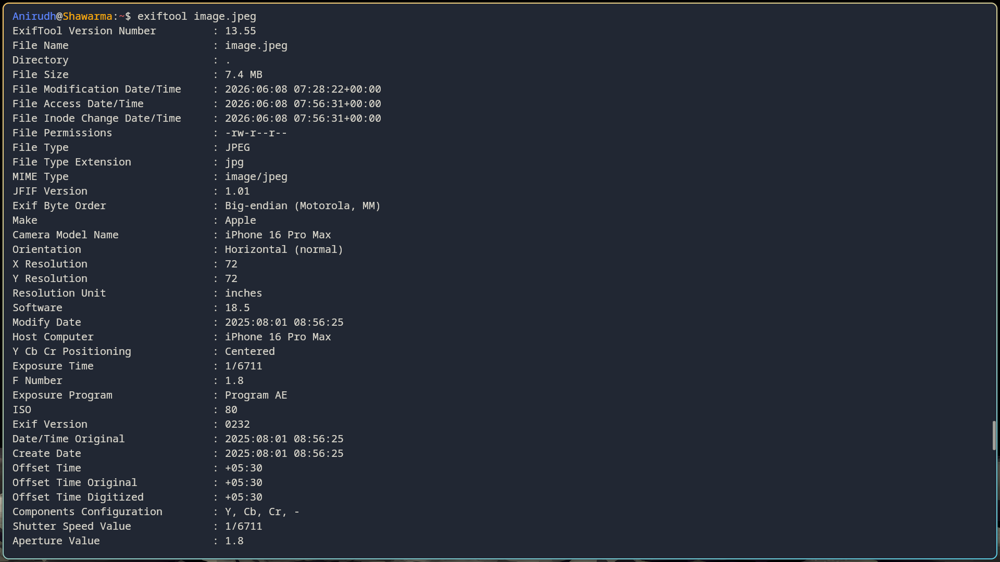
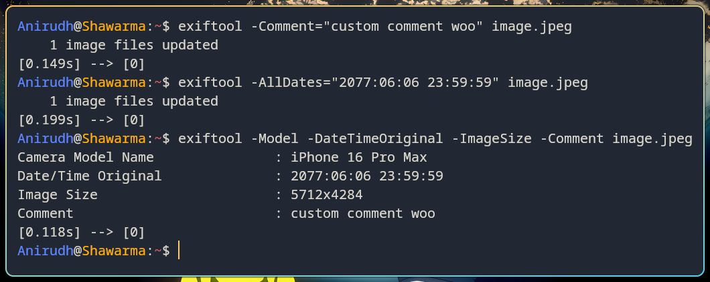
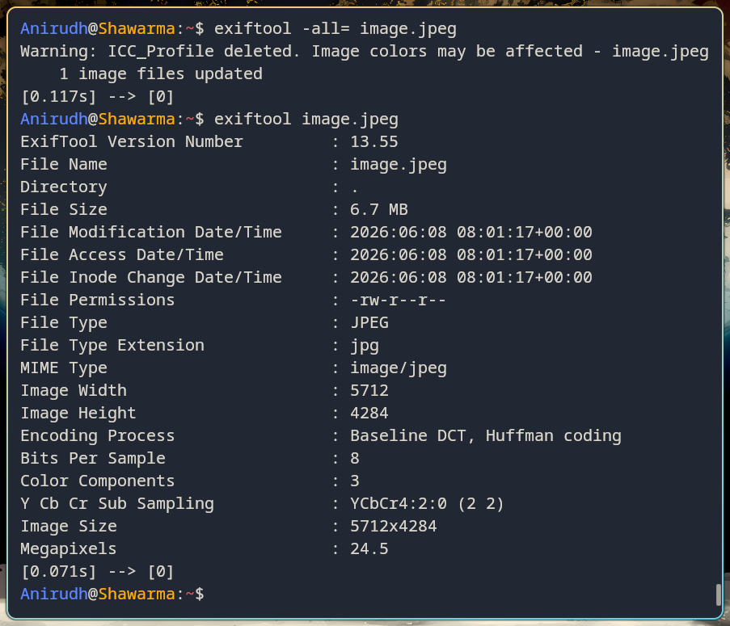

# Timestamps
[Link to the resource](https://ctf101.org/forensics/what-is-metadata/)

### Overview
- It is the hidden data about a file within it's structure
- Metadata in an image involves camera details, software used, etc while audio files include the track details
- `exiftool` is used to read the EXIF data (metadata) of files, specifically photos

### Filesystem Timestamps (MAC)
- Events are tracked based on *MAC* timestamps:
    - *M*odification - When the file was last edied
    - *A*ccess - When the file was last opened or read
    - *C*reation - When the file was initially created
- Any changes to the files can generate the timestamps in different patterns
- Hence these patterns lead to a timeline of how and when the files were tampered

## Snapshots

- Running `exiftool` on the image gives the following output

- Clues are ususally hidden in the metadata
- Adding a custom metadata is possible as a form of a comment or by existing metadata
```
exiftool -Comment="custom metadata woo" image.jpeg
```
```
exiftool -AllDates="2077:06:06 23:59:59" image.jpeg
```
- Getting specific details instead of a whole dump of meta data requires their tags
```
exiftool -Model -DateTimeOriginal -ImageSize -Comment image.jpeg
```

- Destroying all metadata is a good habit before sharing anything online
```
exiftool -all= image.jpeg
```

