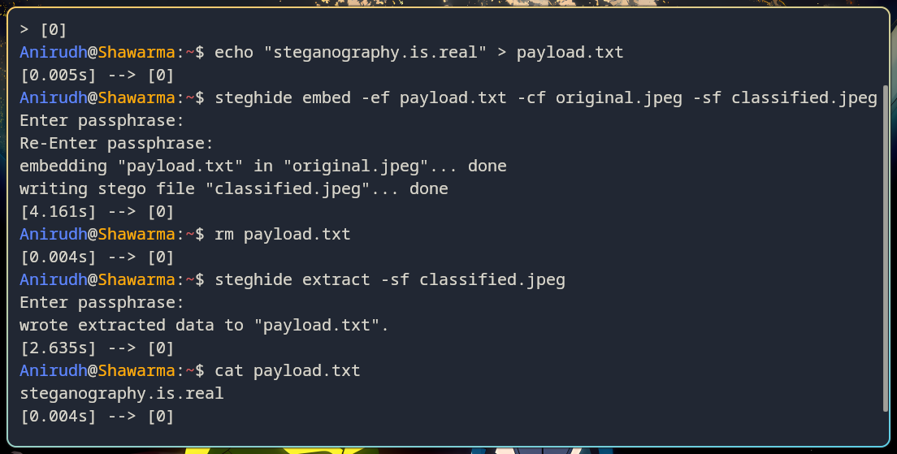
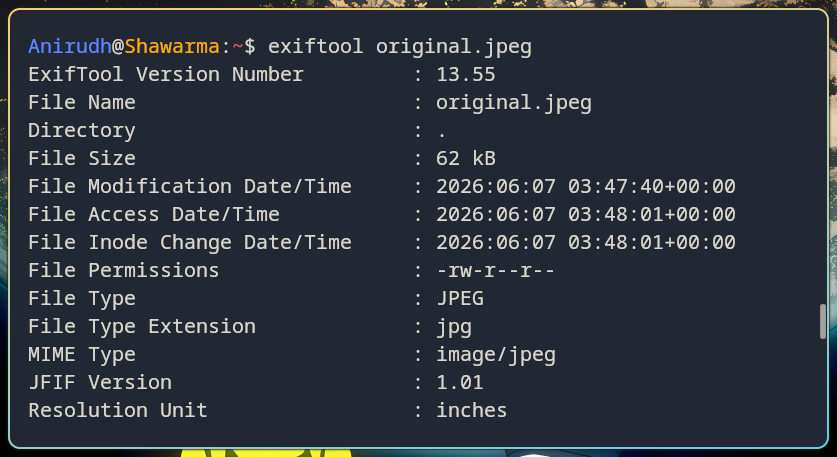
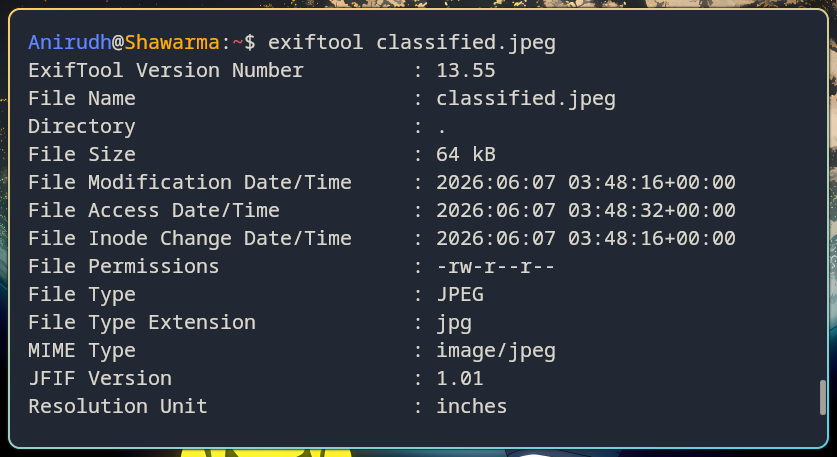

# Steganography
[Link to the resource](https://ctf101.org/forensics/what-is-stegonagraphy/)

### Overview
- Steganography ---> hiding data in plain sight
- Whole idea revolves around hiding that the secret data even exists at all

### Least Significant Bit
- Bytes make up files, each byte ---> 8 bits and the 8th bit is the LSB
- For images, each pixel's LSB can be changed to add up to a hidden binary string
- That binary string can be decoded into text or another file
- The change in the original file is insignificant

## Snapshots

- Using `steghide` to inject and extract hidden data on the above image
- To inject a payload:
```
steghide embed -ef payload.txt -cf original.jpeg -sf classified.jpeg
```  
- To extract a payload:
```
steghide extract -sf classified.jpeg
```


- Using `exiftool`, we can see both the images are similar in size



- Visually, both the images are impossible to distinguish


