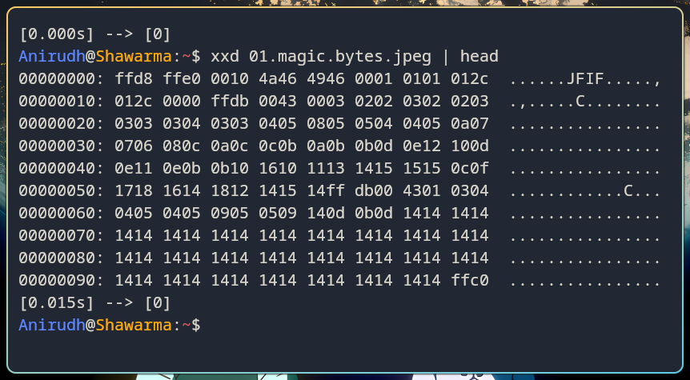
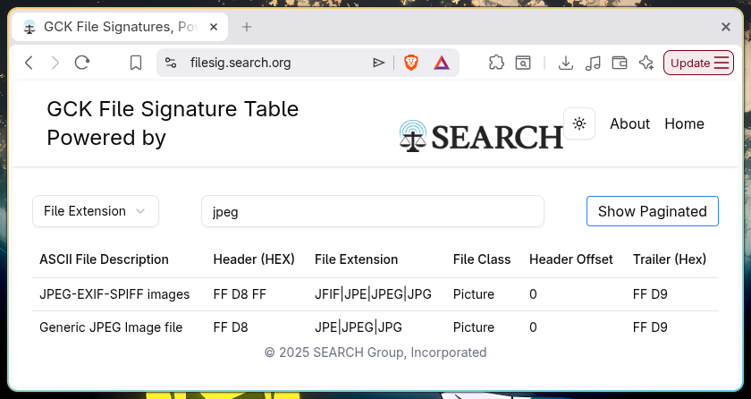

# Forensics

## TL;DR

---

## 1. File Formats
[Link to the resource](https://ctf101.org/forensics/what-are-file-formats/)

- The format of the file is important to open and handle data properly
- Files can contain *metadata* showing additional information about data ---> usually hidden

### Magic Bytes
- Files with formats like `JPEG`, `PDF` and `ZIP` begin with unique bytes ---> usefull for identification of the format
- These are called **Magic Bytes** or **File Signatures**
- Usually 2-4 bytes long

### Snapshots
  
- Using `xxd` on the above image gives the following output  
```
xxd 01.magic.bytes.jpeg | head
```  
- Piping `head` prints only the heading bytes  
  
- Confirmed it is `JPEG` format using [Gary Kessler's](http://www.garykessler.net/library/file_sigs.html) database  


